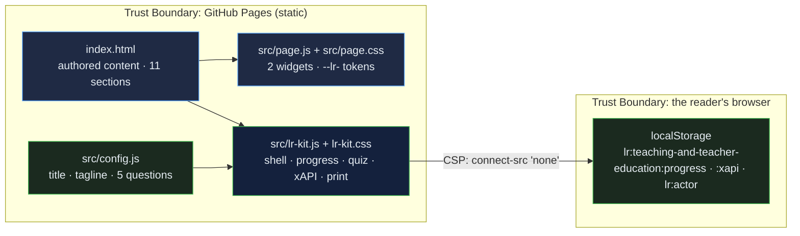

# Teaching, Teacher Education & Curriculum: a graduate-level guide to the craft of teaching, how teachers are made, and how curriculum is designed, with a high-leverage practice explorer and a scored theory self-check

[](https://github.com/Freddricklogan/teaching-and-teacher-education/actions/workflows/deploy.yml)
[](#5-getting-started--verification)
[](https://github.com/Freddricklogan/teaching-and-teacher-education/actions/workflows/codeql.yml)
[](LICENSE)
[](https://freddricklogan.github.io/teaching-and-teacher-education/)

## 1. Executive Summary & Business Impact

**Problem statement.** Teacher candidates, instructional coaches and curriculum leaders talk fluently about constructivism and rigour and then run a classroom by habit: a drill that is really behaviourist, a discussion that is really coverage, a curriculum map that lists topics without evidence of learning. The theories are known; the connection from a theory to a specific move, and from a move to a design decision, is rarely made explicit.

**Solution & value delivered.** An eleven-section resource that grounds teaching in five learning traditions, names the high-leverage practices novices can rehearse, sets out culturally relevant and inclusive teaching, argues for practice-based teacher education and job-embedded development, goes discipline-deep into mathematics and science education, treats curriculum as intended, enacted, hidden and assessed with backward design at scale, and separates assessment for learning from assessment of it — with a practice explorer and a scored self-check that asks the reader to name the theory behind five classroom activities. The page is one of ten
resources built on the shared
[Learning Resource Kit](https://github.com/Freddricklogan/learning-resource-kit):
an Executive Shell with live counts, collapsible sections whose progress is
saved in the reader's browser, a five-question quiz written for this
resource that records xAPI 1.0.3 statements locally, and a print layout that
opens every section. Nothing leaves the page; the content-security policy
forbids network calls.

**[→ Read the full case study](docs/CASE_STUDY.md)**

| Outcome | How this repo delivers it |
| --- | --- |
| A resource, not a slide deck | 11 sections (14 minutes at 230 wpm) with an executive summary first: theories of learning, effective teaching, high-leverage practice explorer, culturally responsive teaching, teacher education and development, mathematics education, science education, curriculum design, theory self-check, assessment, glossary |
| Interactive where it matters | 2 authored widgets (see §4) kept intact through the conversion and verified under a strict CSP |
| Evidence of learning | Quiz answers and completion recorded as xAPI statements with an anonymous actor; inspectable on the page |
| Reviewable by an institution | No inline script or style, typed buttons, table bodies, a `<main>` landmark; html-validate and ESLint in CI |
| Usable everywhere | Keyboard-operable sections, deep links that open their section, print stylesheet, no horizontal scroll at 400 px |

## 2. Demonstrated Competencies & Technical Skills

- **EdTech & Human-Centered Design** — name the theory behind the move: the self-check gives immediate feedback on why an activity reflects behaviourism, cognitivism, constructivism, social constructivism or connectivism; the practice explorer shows what each move looks like in a classroom, not only what it is called; discipline sections use the field's own frameworks (NCTM, NGSS).
- **Systems Architecture & CS** — authored content in `index.html`, its
  widgets in `src/page.js`, its styles in `src/page.css` under the `--lr-`
  namespace; the kit vendored as `src/lr-kit.js`; config and tests that
  fail CI if a quiz question is malformed.
- **Cybersecurity & Compliance** — `default-src 'none'; script-src 'self';
  connect-src 'none'`; no third-party script; Trivy, npm audit and CodeQL in
  CI.
- **Data Science & AI** — reading time and section counts computed from the
  content at load; scores recorded as scaled results, never claimed.

## 3. System Architecture & Data Flow



## 4. Technical Highlights & Engineering Decisions

### The authored widgets

| Widget | What it does |
| --- | --- |
| High-leverage practice explorer | Five tabs — eliciting student thinking, explaining and modelling, leading discussions, checking understanding, culturally responsive teaching — each with what it is, why it matters and what it looks like |
| Which learning theory fits this activity? | Five classroom activities to match to a learning tradition, with immediate feedback, the reasoning, and a running score |

### ADR-1 — Convert, do not rewrite

**Context.** The original was one hand-authored file: rich content and
bespoke widgets, but inline styles and scripts that no content-security
policy or validator accepts.

**Decision.** The kit's converter moved the stylesheet and scripts out of
the page, replaced 63 inline style attributes with
12 generated classes, namespaced 26 custom properties, typed
5 buttons, gave 2 tables a body and wrapped the content in a `<main>` landmark. The content and
widget code were not rewritten; `AUDIT.md` lists every change.

**Consequence.** The page passes html-validate under a strict CSP with its
original behaviour intact, and the change is auditable line by line.

### ADR-2 — One quiz, one attempt, standard statements

**Context.** The page's own self-checks vanish on reload and record nothing.

**Decision.** Five questions written from this resource's content live in
`src/config.js`; the kit accepts a single attempt per question, shows the
explanation, and records xAPI *answered* and *completed* statements with a
scaled score, kept in the browser and shown as JSON.

**Consequence.** The score reflects what the reader knew before the
explanation, and an institution can see the exact statements a learning
record store would receive.

### ADR-3 — Progress means opened

**Context.** Scroll depth is easy to measure and says little about reading.

**Decision.** A section counts as opened when its collapsed state is
removed — by click, keyboard, deep link or "Expand all" — and an
*experienced* statement is recorded once.

**Consequence.** The KPI strip is conservative: 11 sections, and the count
only rises when the reader opens one.

## 5. Getting Started & Verification

**Prerequisites.** Node 22 for the checks; the page itself needs only a
browser.

```bash
git clone https://github.com/Freddricklogan/teaching-and-teacher-education.git
cd teaching-and-teacher-education
npm ci
npm run check     # eslint → html-validate → vitest
npx serve .       # open http://localhost:3000
```

**Verification — the numbers this repository actually produced:**

```bash
npm run lint      # 0 problems
npm run validate  # html-validate index.html: clean
npm run coverage  # 7 passed; All files 79.84% (config.js 100%, vendored lr-kit.js 78.75%)
```

| Check | Result |
| --- | --- |
| Unit tests (Vitest, jsdom) | **7 passed / 7** across 2 files — quiz validity, page invariants, the kit mounted on this page |
| Coverage | All files **79.84%** statements: `src/config.js` 100%, vendored `src/lr-kit.js` 78.75% from this page's smoke test (the kit's own suite covers it at 99%) |
| ESLint, html-validate | clean |
| Conversion audit | 63 inline styles → 12 classes · 26 tokens namespaced · 5 buttons typed · 2 tables fixed |
| Headless Chrome smoke | **0 console errors**; all 2 widgets exercised; sections opened 11/11 on Expand all; no horizontal scroll at 1200 or 400 px |

## 6. Live Demo & Production Showcase

**<https://freddricklogan.github.io/teaching-and-teacher-education/>**

**30-second guided walkthrough.** Press **Take the 30-second tour**.

1. **A graduate-level resource, not a slide deck** — 11 sections, about
   14 minutes of reading.
2. **Open a section** — the first section opens and the count rises.
3. **Check your understanding** — five questions on PCK, scaffolding, culturally relevant pedagogy, fluency and backward design.
4. **Your statements, inspectable** — the xAPI JSON recorded in this browser.

The quiz covers:
- Shulman's pedagogical content knowledge
- scaffolding in the Zone of Proximal Development
- Ladson-Billings' three pillars
- conceptual understanding and procedural fluency
- the order of backward design

Part of the resource hub at <https://freddricklogan.github.io/resources/>.
